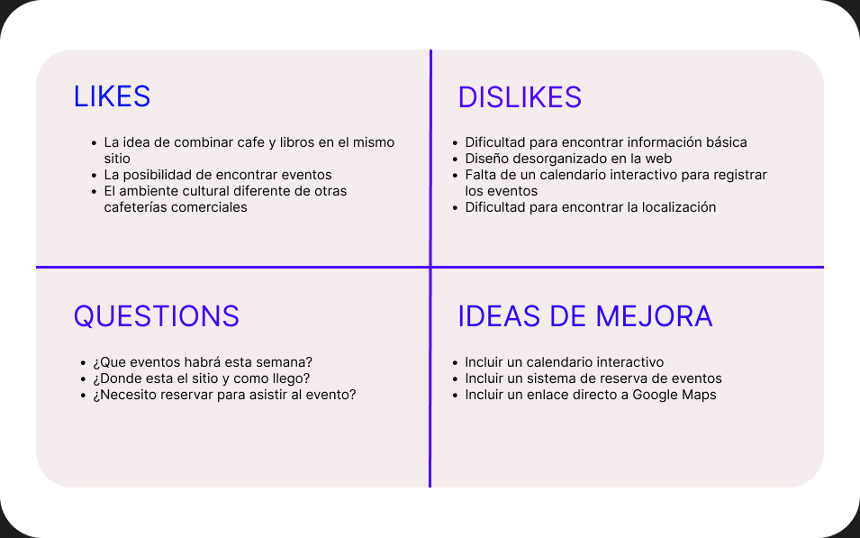
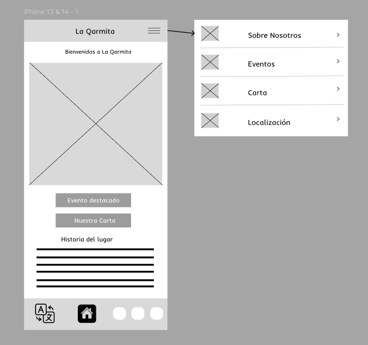

## Paso 2. UX Design  

>>> Cualquier título puede ser adaptado. Recuerda borrar estos comentarios del template en tu documento

### 2.a Reframing / IDEACION: Feedback Capture Grid / EMpathy map 
 

 

 Interesante | Críticas     
| ------------- | -------
  Preguntas | Nuevas ideas
  
    
>>> Explica el Problema y plantea una hipótesis. Es decir, explica aquí qué 
>>> se plantea como "propuesta de valor" para un nuevo diseño de aplicación propio

### 2.b ScopeCanvas

----

>>> Propuesta de valor, pero ahora en vez de un texto es un ScopeCanvas que has subido a P2/ y enlazado desde aqui. Tambien vale una imagen miniatura del recurso.
>>> No olvides que tu propuesta ya tiene un nombre corto y puedes actualizar la cabecera de este archivo

### 2.b User Flow (task) analysis 
 
 
-----

>>> Definir "User Map" y "Task Flow" ... enlazar desde P2/ y describir brevemente

### 2.c IA: Sitemap + Labelling 
 
----

>>> Identificar términos para diálogo con usuario (evita el spanglish) y la arquitectura de la información. Es muy apropiado un diagrama tipo sitemap y una tabla que se ampliaría para llevar asociado la columna iconos (tanto para la web como para una app). 

Término | Significado     
| ------------- | -------
  Página de inicio  | Página que da acceso al resto de funcionalidades de la web
  Sobre Nosotros  | Sección dedicada a la filosofía de la cafetería, sus valores y el equipo.
  Historia  | Narrativa sobre los orígenes de la cafetería, la selección de los productos y la trayectoria.
  Eventos  | Espacio informativo sobre las actividades culturales, exposiciones y otros sucesos
  Próximos Eventos  | Listado de Eventos que acontecerán en las próximas semanas con sus descripciones
  Calendario Reserva  | Herramienta interactiva para que los clientes se inscriban en eventos específicos rellenando con sus datos personales a tarvés del Formulario Reserva.
  Menú  | Carta digital detallada con precios, alérgenos y categorías (bebidas, para picar, tartas y postres, snacks latinos).
  Localización  | Información geográfica, mapa interactiva de Google Maps y detalles sobre cómo llegar al local.
  Contacto  | Formulario de consultas, enlaces a redes sociales, teléfono y horario de atención al cliente.

### 2.d Wireframes
Inicio en móvil:

 

Eventos en móvil:

 

Carta en móvil: 

 

>>> Plantear el diseño del layout para Web/movil (organización y simulación). Describa la herramienta usada 

 
