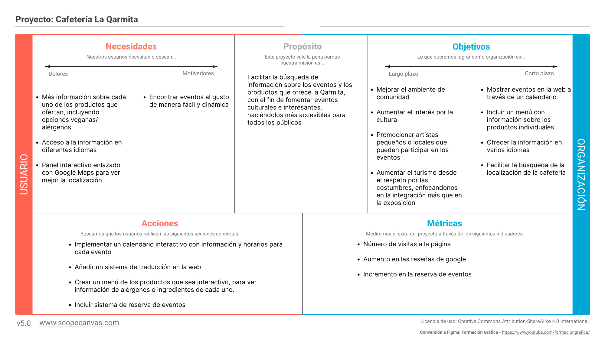
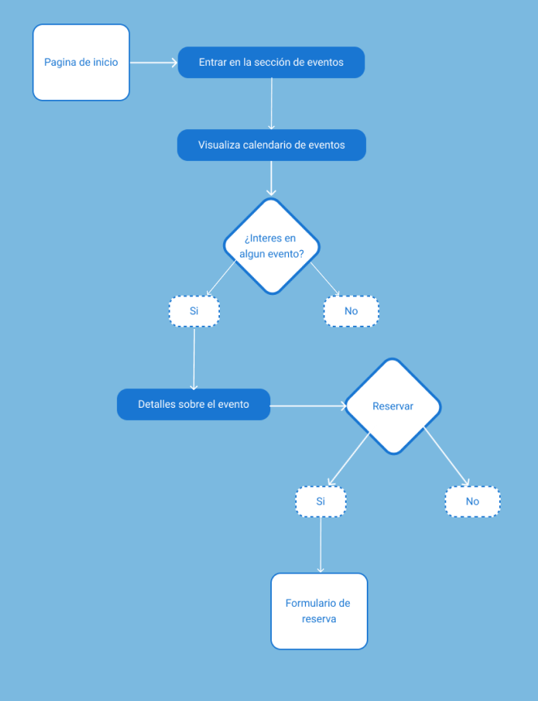
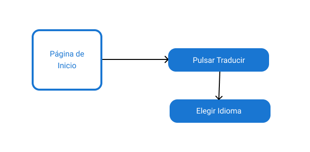
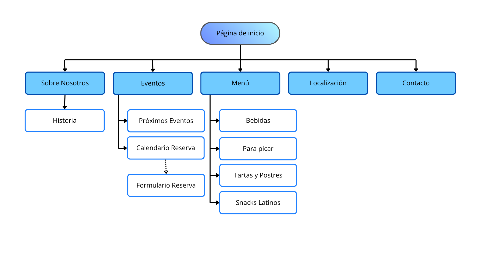
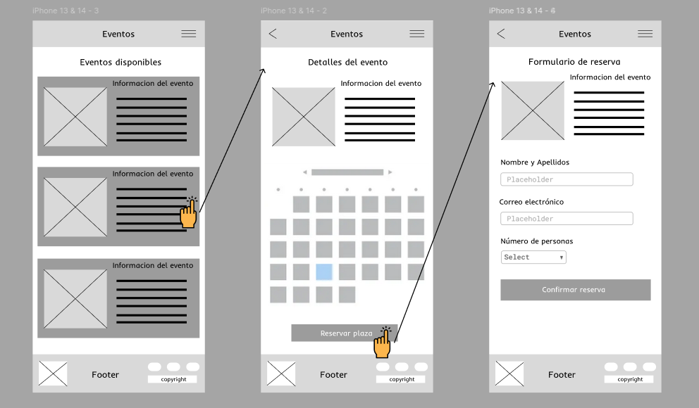
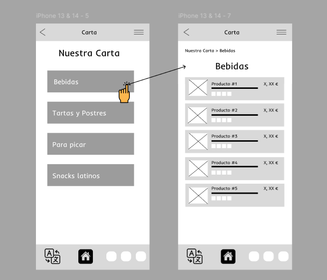

# DIU26
Prácticas Diseño Interfaces de Usuario (Tema: .... ) 

* [Guiones de prácticas](GuionesPracticas/)
* [Guía para crea tu Case Study](Guia_CaseStudy.md)
* Sala de la Fama [DIU Hall of fame](https://github.com/mgea/DIU/tree/master/hall_of_fame) donde se pueden encontrar Case Study destacados de otros años.

Actualizado: 14/01/2026

## Paso 0 My UX-Case Study
 
-----

>>> Este documento es el esqueleto del Case Study que explica el proceso de desarrollo de las 5 prácticas de DIU. Aparte de subir cada entrega a PRADO, se debe actualizar y dar formato de informe final a este documento online. Elimine este tipo de texto / comentarios desde la práctica 1 conforme proceda a cada paso

>>> Hay que Publicar de forma incremental "my Case Study" en Github... Es el momento de dejar este documento para que sea evaluado y calificado como parte de la práctica
>>> Documente bien la cabecera y asegurese que ha resumido los pasos realizados para el diseño de su producto

Grupo: DIUx_AABB.  Curso: 2025/26 

Nombre del Proyecto: 

>>> Decida el nombre corto de su propuesta en la práctica 2 

Descripción: 

>>> Describa la idea de su producto en la práctica 2 

Logotipo: 

>>> Si diseña un logotipo para su producto en la práctica 3 pongalo aqui, a un tamaño adecuado. Si diseña un slogan añadalo aquí

Miembros y nombre del equipo:
 * :bust_in_silhouette:  AA     :octocat:     
 * :bust_in_silhouette:  BB     :octocat:

>>> Los equipos son de 2 personas. Identifícaros con el nombre del Grupo y los enlaces a los perfiles de GitHub de cada integrante

----- 

 

# Proceso de Diseño 

 

## Paso 1. UX User & Desk Research & Analisis 

>>> Cualquier título puede ser adaptado. Recuerda borrar estos comentarios del template en tu documento

### 1.a User Reseach Plan
 
-----

>>> Describe el plan en tu User Research (cómo se plantea la selección de usuarios). Borra esta línea cuando lo tengas.  
Aqui ponemos mi experiencia con la creacion de paginas web y ademas es necesario exponer ideas de qué creo que se puede mejorar para la aplicación en específico. Hay que venderse al cliente (invent pero que tenga algo de coherencia)
>>> ver que tipo de comportamientos tenemos que analizar

## 1 Project Background

**Context**

Este proyecto busca mejorar la experiencia de los usuarios que visitan La Qarmita, una cafetería cultural en Granada que organiza eventos, talleres y actividades relacionadas con la cultura y la sostenibilidad.

La investigación se centra en comprender cómo los usuarios descubren estos eventos, qué información necesitan antes de asistir y qué barreras encuentran durante el proceso.

**Hypothesis**

La falta de información clara y accesible sobre los eventos, horarios y actividades puede dificultar que los usuarios descubran y participen en las actividades de La Qarmita.

Mejorar la organización de la información y facilitar el acceso a los eventos podría aumentar la participación y mejorar la experiencia de los usuarios.

## 2 Research Goals

- Identificar cómo los usuarios descubren eventos culturales en cafeterías o espacios culturales.

- Comprender qué información necesitan antes de decidir asistir a un evento.

- Analizar la experiencia del usuario al buscar información sobre el local y sus actividades.

- Detectar posibles mejoras en accesibilidad, información y experiencia del usuario.

## 3 Research Methods

**Qualitative research methods (Why users do that)**

- Observación etnográfica en cafeterías o espacios culturales.

- Entrevistas breves a usuarios interesados en eventos culturales.

- Análisis del comportamiento de usuarios al buscar información sobre eventos.

**Quantitative research methods (What users do)**

- Encuestas online sobre hábitos de ocio y búsqueda de eventos.

- Análisis de cómo los usuarios descubren eventos culturales en la ciudad.

**KPI indicators**

- Facilidad para encontrar información sobre eventos.

- Tiempo necesario para localizar información relevante.

- Interés de los usuarios en participar en actividades culturales.

## 4 Research Questions

- ¿Cómo descubren los usuarios eventos culturales en cafeterías o espacios similares?

- ¿Qué información consideran más importante antes de asistir a un evento?

- ¿Qué dificultades encuentran al buscar información sobre actividades culturales?

- ¿Qué factores influyen en la decisión de asistir a un evento?
 
- ¿Se ofrece la información necesaria de los productos que se ofrecen?

## 5 Experience in this field

**My personal experience**

- Experiencia como usuario en cafeterías culturales o espacios con eventos.

- Participación ocasional en actividades culturales en la ciudad.

**My experience as designer is…**

- Análisis de experiencias digitales para mejorar la accesibilidad a la información.

- Observación del comportamiento de los usuarios al buscar información online.

**As observer (ethnography)**

- Observación del comportamiento de usuarios en cafeterías o espacios culturales.

- Análisis de cómo interactúan con la información sobre eventos o actividades.

**People say (empathy)**

- Los usuarios valoran encontrar información clara sobre eventos, horarios y carta de productos.

- Prefieren descubrir actividades culturales de forma sencilla y rápida.

## 6 Participant Recruitment

**Who are the users?**

- Personas locales interesadas en eventos culturales.

- Estudiantes universitarios que buscan actividades culturales en la ciudad.

- Personas interesadas en cafeterías con eventos.

### 1.b Competitive Analysis
 
-----

>>> Describe brevemente características de las aplicaciones que tiene asignadas tu grupo. Decidete por una y explica por qué se ha seleccionado. Borra esta línea cuando lo tengas. 
Aquí lo que hay que completar es una descripcion breve (de la que aun no tengo mucha idea), cosas específicas que tiene la página, a lo mejor, que es lo que puede faltar. Cafeteria objetivo
>>> Analizar caracteristicas con respecto a otra. Que es lo quee le hace unico y ue es lo que le falta (ej:logotipos, imagen de marca, cuestiones funcionales, como llegar a ella...) Para que publico esta pensada.

Hemos seleccionado a “La Qarmita: libros, café y eventos” como la cafetería para realizar el estudio debido a que creemos que tiene numerosas características a mejorar en cuanto a diseño, lo que la hace un buen objeto de estudio. Su web está en formato cuenta de Blogspot, lo que limita mucho la capacidad de trabajo y no ofrece las posibilidades para mucha mejora.

Vamos a realizar un estudio de análisis competitivo en el que vamos a comparar esta cafetería con otras dos localizadas en Granada: Mimimi e Ysla. La primera no dispone de una web como tal, si no un perfil de Facebook mientras que Ysla es una cadena de cafeterías con varias localizaciones en Granada, por lo que se nota que disponen de el presupuesto necesario como para hacer una página web propia. Esta dualidad consideramos que es oportuna para hacer las comparaciones con nuestra elección.

A continuacion mostramos la tabla de análisis competitivo, donde se comparan algunas características que ofrecen los portales:

### 1.c Personas
 
-----

>>> Junto con la captura de pantalla de la ficha de la persona, haz una breve descripción de la misma. Recuerda que son dos. Los recursos de imagen deberán estar dentro de la carpeta P1/ Cuando termines, borra esta línea.

 Para este apartado utilizaremos dos personas con un perfil ideal para este sector.

 Por una parte, tenemos a Pedro Martin:

  
  
  
Como se puede ver, Pedro valora los espacios tranquilos donde poder desconectar después del trabajo y disfrutar de actividades culturales. Suele buscar información sobre lugares y eventos desde su smartphone antes de decidir si visitarlos, prestando atención al ambiente del local y a la claridad de la información disponible. Por ello, Pedro representa a un tipo de usuario interesado en descubrir espacios como La Qarmita, donde pueda combinar ocio, cultura y un ambiente relajado.

Por otro lado, está Maria Zhang, estudiante Erasmus+ que viene a Granada desde Munich con muchas ganas de aprender de la zona, el idioma, sobre su gente y sobre todo, por el arte y la literatura de aquí.

Maria es joven y tiene muchas ganas de aprender y llevar a cabo una inmersión profunda en la cultura de la ciudad, por lo que le gustaría estar al tanto de los eventos que ofrece el establecimiento mientras disfruta de un café por las tardes. Es un tipo de usuario interesante ya que al ser extranjera y además vegana, sus necesidades son un poco más específicas que otros usuarios (en relación a los idiomas e información que ofrece la página).

### 1.d User Journey Map
 
----

>>> Describe el porqué de las dos experiencias de usuario contadas en el journey map. Por ejemplo, reflexiona si te parece que son habituales. Enlaza con los recursos journey que están en la carpeta P1/. Borra esta linea del template cuando termines.

Journey Map de Pedro:

 

Journey Map de Maria:

 

### 1.e Usability Review
 
----

>>>  El objetivo es revisar la usabilidad del competidor seleccionado. Usamos un checklist de verificación. Tras usarlo, subelo a la carpeta P1/ Ofrece aquí un parrafo para:
>>> - Enlace al documento:  (xls/pdf) 
>>> - URL y Valoración numérica obtenida: 
>>> - Comentario sobre la revisión:  (puntos fuertes y débiles detectados)

- Enlace al documento pdf:

- Valoración numérica obtenida: 60 (moderate)

- Puntos fuertes detectados:

  I. Información clara y comprensible
  
  II. Contenido cultural relevante
  
  III. Imagenes del local y eventos

- Punto débiles detectados:

  I. Diseño anticuado
  
  II. Mapa no interactivo
  
  III. Escasa interacción con redes sociales
  
  IV. Ayuda y contacto poco visibles
  
  V. Falta de funcionalidades importantes (registro de eventos, reservas)

 

## Paso 2. UX Design  

>>> Cualquier título puede ser adaptado. Recuerda borrar estos comentarios del template en tu documento

### 2.a Reframing / IDEACION: Feedback Capture Grid / EMpathy map 
 
----

>>> Comenta con un diagrama los aspectos más destacados a modo de conclusion de la práctica anterior. De qué carece la competencia?? Tu diagrama puede ser una figura subida a la carpeta P2/

 Interesante | Críticas     
| ------------- | -------
  Preguntas | Nuevas ideas
  
    
>>> Explica el Problema y plantea una hipótesis. Es decir, explica aquí qué 
>>> se plantea como "propuesta de valor" para un nuevo diseño de aplicación propio

### 2.b ScopeCanvas

----

>>> Propuesta de valor, pero ahora en vez de un texto es un ScopeCanvas que has subido a P2/ y enlazado desde aqui. Tambien vale una imagen miniatura del recurso.
>>> No olvides que tu propuesta ya tiene un nombre corto y puedes actualizar la cabecera de este archivo

### 2.b User Flow (task) analysis 
 
 
-----

>>> Definir "User Map" y "Task Flow" ... enlazar desde P2/ y describir brevemente

### 2.c IA: Sitemap + Labelling 
 
----

>>> Identificar términos para diálogo con usuario (evita el spanglish) y la arquitectura de la información. Es muy apropiado un diagrama tipo sitemap y una tabla que se ampliaría para llevar asociado la columna iconos (tanto para la web como para una app). 

Término | Significado     
| ------------- | -------
  Página de inicio  | Página que da acceso al resto de funcionalidades de la web
  Sobre Nosotros  | Sección dedicada a la filosofía de la cafetería, sus valores y el equipo.
  Historia  | Narrativa sobre los orígenes de la cafetería, la selección de los productos y la trayectoria.
  Eventos  | Espacio informativo sobre las actividades culturales, exposiciones y otros sucesos
  Próximos Eventos  | Listado de Eventos que acontecerán en las próximas semanas con sus descripciones
  Calendario Reserva  | Herramienta interactiva para que los clientes se inscriban en eventos específicos rellenando con sus datos personales a tarvés del Formulario Reserva.
  Menú  | Carta digital detallada con precios, alérgenos y categorías (bebidas, para picar, tartas y postres, snacks latinos).
  Localización  | Información geográfica, mapa interactiva de Google Maps y detalles sobre cómo llegar al local.
  Contacto  | Formulario de consultas, enlaces a redes sociales, teléfono y horario de atención al cliente.

### 2.d Wireframes
Inicio en móvil:

Eventos en móvil:

 

Carta en móvil: 

 

>>> Plantear el diseño del layout para Web/movil (organización y simulación). Describa la herramienta usada 

 

## Paso 3. Mi UX-Case Study (diseño)

>>> Cualquier título puede ser adaptado. Recuerda borrar estos comentarios del template en tu documento

### 3.a Moodboard

-----

>>> Diseño visual con una guía de estilos visual (moodboard) 
>>> Incluir Logotipo. Todos los recursos estarán subidos a la carpeta P3/
>>> Explique aqui la/s herramienta/s utilizada/s y el por qué de la resolución empleada. Reflexione ¿Se puede usar esta imagen como cabecera de Instagram, por ejemplo, o se necesitan otras?

### 3.b Landing Page
 
----

>>> Plantear el Landing Page del producto. Aplica estilos definidos en el moodboard

### 3.c Guidelines
 
----

>>> Estudio de Guidelines y explicación de los Patrones IU a usar 
>>> Es decir, tras documentarse, muestre las deciones tomadas sobre Patrones IU a usar para la fase siguiente de prototipado. 

### 3.d Mockup
 
----

>>> Consiste en tener un Layout en acción. Un Mockup es un prototipo HTML que permite simular tareas con estilo de IU seleccionado. Muy útil para compartir con stakeholders

 

## Paso 4. Pruebas de Evaluación 

### 4.a Reclutamiento de usuarios 

-----

>>> Breve descripción del caso asignado (llamado Caso-B) con enlace al repositorio Github
>>> Tabla y asignación de personas ficticias (o reales) a las pruebas. Exprese las ideas de posibles situaciones conflictivas de esa persona en las propuestas evaluadas. Mínimo 4 usuarios: asigne 2 al Caso A y 2 al caso B.

| Usuarios | Sexo/Edad     | Ocupación   |  Exp.TIC    | Personalidad | Plataforma | Caso
| ------------- | -------- | ----------- | ----------- | -----------  | ---------- | ----
| User1's name  | H / 18   | Estudiante  | Media       | Introvertido | Web.       | A 
| User2's name  | H / 18   | Estudiante  | Media       | Timido       | Web        | A 
| User3's name  | M / 35   | Abogado     | Baja        | Emocional    | móvil      | B 
| User4's name  | H / 18   | Estudiante  | Media       | Racional     | Web        | B 

### 4.b Diseño de las pruebas 
 
-----

>>> Planifique qué pruebas se van a desarrollar. ¿En qué consisten? ¿Se hará uso del checklist de la P1?

### 4.c Cuestionario SUS
 
----

>>> Como uno de los test para la prueba A/B testing, usaremos el **Cuestionario SUS** que permite valorar la satisfacción de cada usuario con el diseño utilizado (casos A o B). Para calcular la valoración numérica y la etiqueta linguistica resultante usamos la [hoja de cálculo](https://github.com/mgea/DIU19/blob/master/Cuestionario%20SUS%20DIU.xlsx). Previamente conozca en qué consiste la escala SUS y cómo se interpretan sus resultados
http://usabilitygeek.com/how-to-use-the-system-usability-scale-sus-to-evaluate-the-usability-of-your-website/)
Para más información, consultar aquí sobre la [metodología SUS](https://cui.unige.ch/isi/icle-wiki/_media/ipm:test-suschapt.pdf)
>>> Adjuntar en la carpeta P4/ el excel resultante y describa aquí la valoración personal de los resultados 

### 4.d A/B Testing
 
-----

>>> Los resultados de un A/B testing con 3 pruebas y 2 casos o alternativas daría como resultado una tabla de 3 filas y 2 columnas, además de un resultado agregado global. Especifique con claridad el resultado: qué caso es más usable, A o B?

### 4.e Aplicación del método Eye Tracking 

----

>>> Indica cómo se diseña el experimento y se reclutan los usuarios. Explica la herramienta / uso de gazerecorder.com u otra similar. Aplíquese únicamente al caso B.

  
>>> Cambiar esta img por una de vuestro experimento. El recurso deberá estar subido a la carpeta P4/  

>>> gazerecorder en versión de pruebas puede estar limitada a 3 usuarios para generar mapa de calor (crédito > 0 para que funcione) 

### 4.f Usability Report de B
 
-----

>>> Añadir report de usabilidad para práctica B (la de los compañeros) aportando resultados y valoración de cada debilidad de usabilidad. 
>>> Enlazar aqui con el archivo subido a P4/ que indica qué equipo evalua a qué otro equipo.

>>> Complementad el Case Study en su Paso 4 con una Valoración personal del equipo sobre esta tarea

 

## Paso 5. Exportación y Documentación 

### 5.a Exportación a HTML/React
 
----

>>> Breve descripción de esta tarea. Las evidencias de este paso quedan subidas a P5/

### 5.b Documentación con Storybook

----

>>> Breve descripción de esta tarea. Las evidencias de este paso quedan subidas a P5/

 

## Conclusiones finales & Valoración de las prácticas

>>> Opinión FINAL del proceso de desarrollo de diseño siguiendo metodología UX y valoración (positiva /negativa) de los resultados obtenidos. ¿Qué se puede mejorar? Recuerda que este tipo de texto se debe eliminar del template que se os proporciona 

