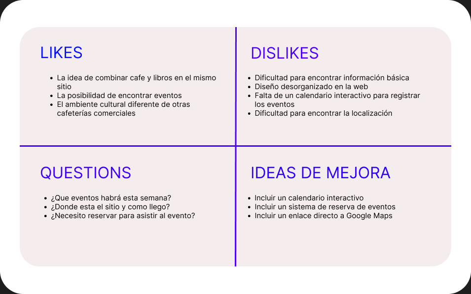
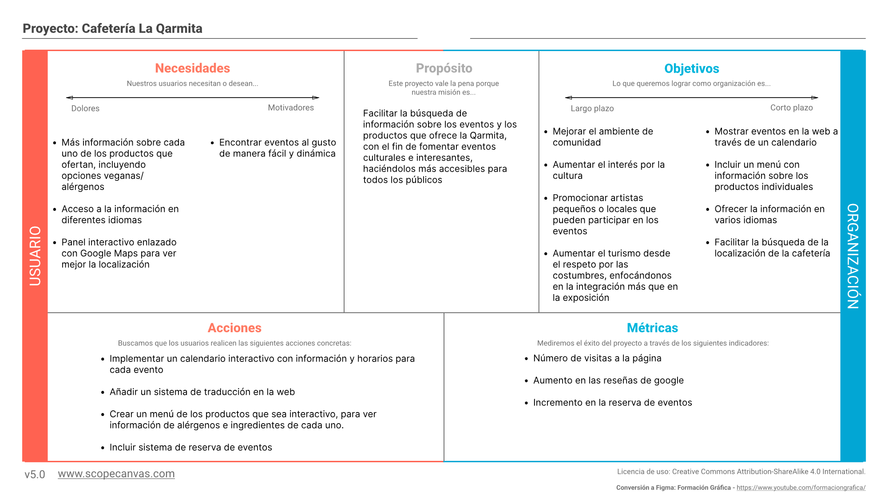
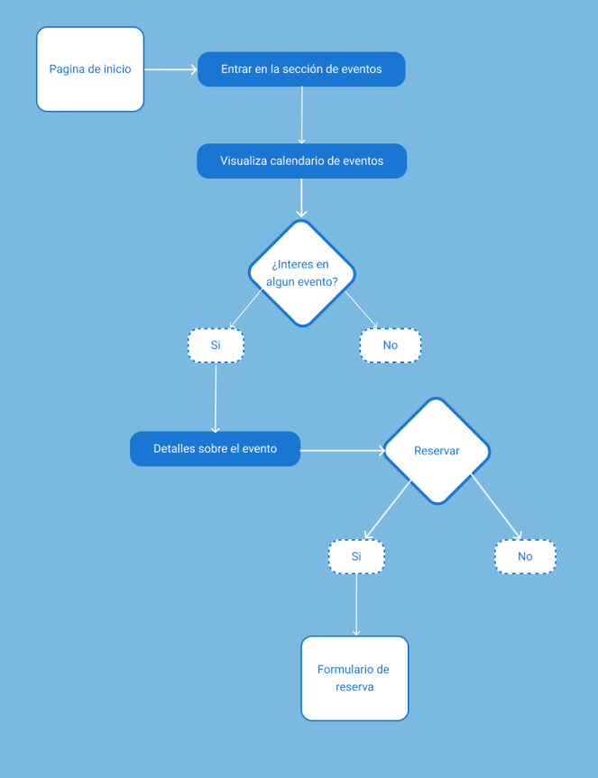
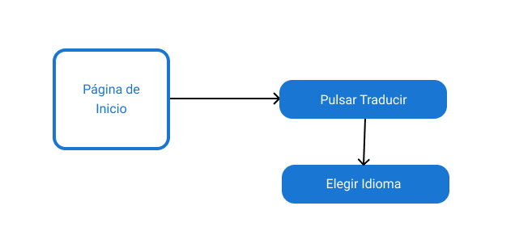
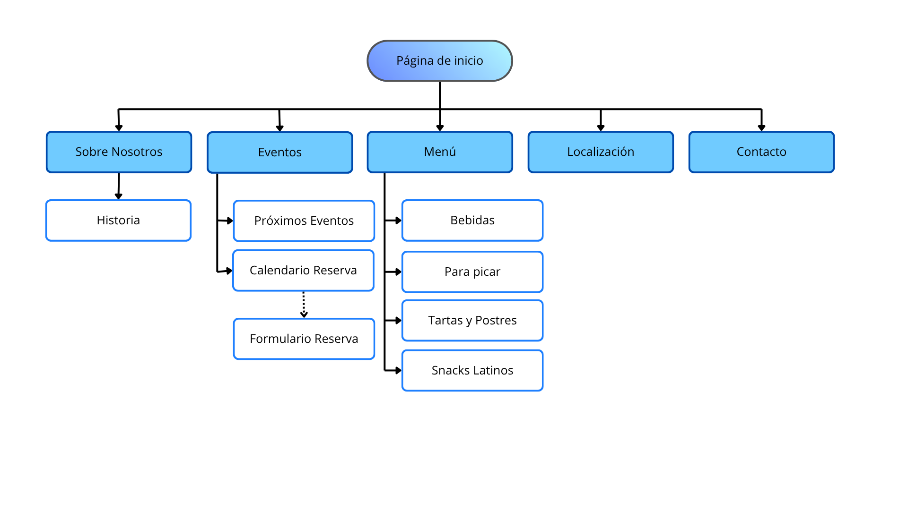
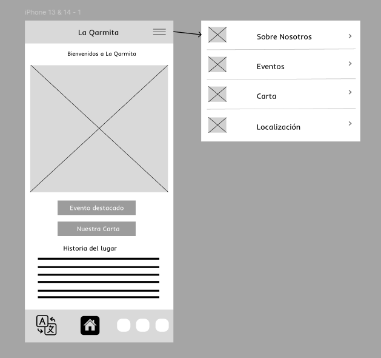
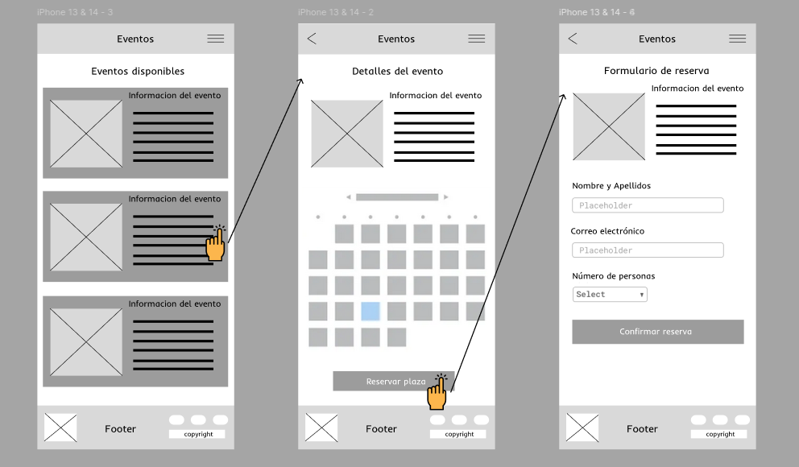
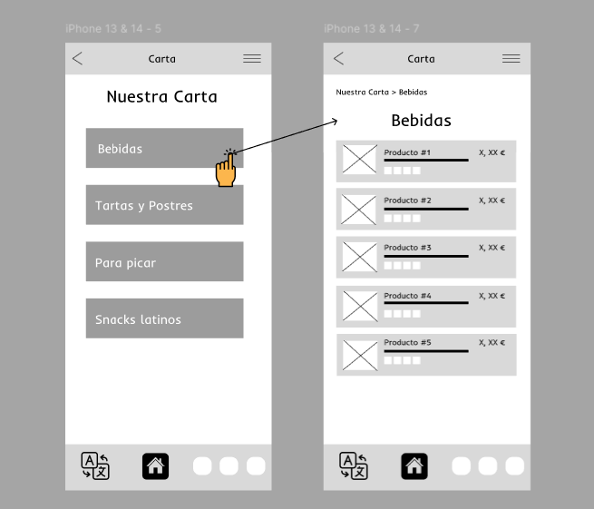

# DIU26
Prácticas Diseño Interfaces de Usuario (Tema: .... ) 

* [Guiones de prácticas](GuionesPracticas/)
* [Guía para crea tu Case Study](Guia_CaseStudy.md)
* Sala de la Fama [DIU Hall of fame](https://github.com/mgea/DIU/tree/master/hall_of_fame) donde se pueden encontrar Case Study destacados de otros años.

Actualizado: 14/01/2026

## Paso 0 My UX-Case Study
 
-----

Grupo: DIU2_Monki.  Curso: 2025/26 

Nombre del Proyecto: 

La Qarmita

Descripción: 

Dar a conocer La Qarmita mejorando su parte digital sin perder la esencia de la misma

Logotipo: 

Miembros y nombre del equipo:
 * :bust_in_silhouette:  Marcos García Álvarez    :octocat: https://github.com/marcosmariness
 * :bust_in_silhouette:  Carlos García Gonzalez   :octocat:

>>> Los equipos son de 2 personas. Identifícaros con el nombre del Grupo y los enlaces a los perfiles de GitHub de cada integrante

----- 

 

# Proceso de Diseño 

 

## DIU - Practica1, entregables

 

### 1.a User Reseach Plan

-----

#### · 1 Project Background

**Context**

Este proyecto busca mejorar la experiencia de los usuarios que visitan La Qarmita, una cafetería cultural en Granada que organiza eventos, talleres y actividades relacionadas con la cultura y la sostenibilidad.

La investigación se centra en comprender cómo los usuarios descubren estos eventos, qué información necesitan antes de asistir y qué barreras encuentran durante el proceso.

**Hypothesis**

La falta de información clara y accesible sobre los eventos, horarios y actividades puede dificultar que los usuarios descubran y participen en las actividades de La Qarmita.

Mejorar la organización de la información y facilitar el acceso a los eventos podría aumentar la participación y mejorar la experiencia de los usuarios.

#### · 2 Research Goals

- Identificar cómo los usuarios descubren eventos culturales en cafeterías o espacios culturales.

- Comprender qué información necesitan antes de decidir asistir a un evento.

- Analizar la experiencia del usuario al buscar información sobre el local y sus actividades.

- Detectar posibles mejoras en accesibilidad, información y experiencia del usuario.

#### · 3 Research Methods

**Qualitative research methods (Why users do that)**

- Observación etnográfica en cafeterías o espacios culturales.

- Entrevistas breves a usuarios interesados en eventos culturales.

- Análisis del comportamiento de usuarios al buscar información sobre eventos.

**Quantitative research methods (What users do)**

- Encuestas online sobre hábitos de ocio y búsqueda de eventos.

- Análisis de cómo los usuarios descubren eventos culturales en la ciudad.

**KPI indicators**

- Facilidad para encontrar información sobre eventos.

- Tiempo necesario para localizar información relevante.

- Interés de los usuarios en participar en actividades culturales.

#### · 4 Research Questions

- ¿Cómo descubren los usuarios eventos culturales en cafeterías o espacios similares?

- ¿Qué información consideran más importante antes de asistir a un evento?

- ¿Qué dificultades encuentran al buscar información sobre actividades culturales?

- ¿Qué factores influyen en la decisión de asistir a un evento?
 
- ¿Se ofrece la información necesaria de los productos que se ofrecen?

#### · 5 Experience in this field

**My personal experience**

- Experiencia como usuario en cafeterías culturales o espacios con eventos.

- Participación ocasional en actividades culturales en la ciudad.

**My experience as designer is…**

- Análisis de experiencias digitales para mejorar la accesibilidad a la información.

- Observación del comportamiento de los usuarios al buscar información online.

**As observer (ethnography)**

- Observación del comportamiento de usuarios en cafeterías o espacios culturales.

- Análisis de cómo interactúan con la información sobre eventos o actividades.

**People say (empathy)**

- Los usuarios valoran encontrar información clara sobre eventos, horarios y carta de productos.

- Prefieren descubrir actividades culturales de forma sencilla y rápida.

#### · 6 Participant Recruitment

**Who are the users?**

- Personas locales interesadas en eventos culturales.

- Estudiantes universitarios que buscan actividades culturales en la ciudad.

- Personas interesadas en cafeterías con eventos.

### 1.b Competitive Analysis

-----

Hemos seleccionado a “La Qarmita: libros, café y eventos” como la cafetería para realizar el estudio debido a que creemos que tiene numerosas características a mejorar en cuanto a diseño, lo que la hace un buen objeto de estudio. Su web está en formato cuenta de Blogspot, lo que limita mucho la capacidad de trabajo y no ofrece las posibilidades para mucha mejora.

Vamos a realizar un estudio de análisis competitivo en el que vamos a comparar esta cafetería con otras dos localizadas en Granada: Mimimi e Ysla. La primera no dispone de una web como tal, si no un perfil de Facebook mientras que Ysla es una cadena de cafeterías con varias localizaciones en Granada, por lo que se nota que disponen de el presupuesto necesario como para hacer una página web propia. Esta dualidad consideramos que es oportuna para hacer las comparaciones con nuestra elección.

A continuacion mostramos la tabla de análisis competitivo, donde se comparan algunas características que ofrecen los portales:

### 1.c Personas

-----

 Para este apartado utilizaremos dos personas con un perfil ideal para este sector.

 Por una parte, tenemos a Pedro Martin:

  
  
  
Como se puede ver, Pedro valora los espacios tranquilos donde poder desconectar después del trabajo y disfrutar de actividades culturales. Suele buscar información sobre lugares y eventos desde su smartphone antes de decidir si visitarlos, prestando atención al ambiente del local y a la claridad de la información disponible. Por ello, Pedro representa a un tipo de usuario interesado en descubrir espacios como La Qarmita, donde pueda combinar ocio, cultura y un ambiente relajado.

Por otro lado, está Maria Zhang, estudiante Erasmus+ que viene a Granada desde Munich con muchas ganas de aprender de la zona, el idioma, sobre su gente y sobre todo, por el arte y la literatura de aquí.

Maria es joven y tiene muchas ganas de aprender y llevar a cabo una inmersión profunda en la cultura de la ciudad, por lo que le gustaría estar al tanto de los eventos que ofrece el establecimiento mientras disfruta de un café por las tardes. Es un tipo de usuario interesante ya que al ser extranjera y además vegana, sus necesidades son un poco más específicas que otros usuarios (en relación a los idiomas e información que ofrece la página).

### 1.d User Journey Map

----

Journey Map de Pedro:

 

Journey Map de Maria:

 

### 1.e Usability Review

----

- Enlace al documento pdf: [Usability-review](https://github.com/charlyggez/UX_CaseStudy/blob/master/P1/Usability-review-template.pdf)

- Valoración numérica obtenida: 60 (moderate)

- Puntos fuertes detectados:

  I. Información clara y comprensible
  
  II. Contenido cultural relevante
  
  III. Imagenes del local y eventos

- Punto débiles detectados:

  I. Diseño anticuado
  
  II. Mapa no interactivo
  
  III. Escasa interacción con redes sociales
  
  IV. Ayuda y contacto poco visibles
  
  V. Falta de funcionalidades importantes (registro de eventos, reservas)

 

## Paso 2. UX Design  

### 2.a Reframing / IDEACION: Feedback Capture Grid / EMpathy map 

 

 

### 2.b ScopeCanvas

----

### 2.b User Flow (task) analysis 
 
 
-----

### 2.c IA: Sitemap + Labelling 
 
----

Término | Significado     
| ------------- | -------
  Página de inicio  | Página que da acceso al resto de funcionalidades de la web
  Sobre Nosotros  | Sección dedicada a la filosofía de la cafetería, sus valores y el equipo.
  Historia  | Narrativa sobre los orígenes de la cafetería, la selección de los productos y la trayectoria.
  Eventos  | Espacio informativo sobre las actividades culturales, exposiciones y otros sucesos
  Próximos Eventos  | Listado de Eventos que acontecerán en las próximas semanas con sus descripciones
  Calendario Reserva  | Herramienta interactiva para que los clientes se inscriban en eventos específicos rellenando con sus datos personales a tarvés del Formulario Reserva.
  Menú  | Carta digital detallada con precios, alérgenos y categorías (bebidas, para picar, tartas y postres, snacks latinos).
  Localización  | Información geográfica, mapa interactiva de Google Maps y detalles sobre cómo llegar al local.
  Contacto  | Formulario de consultas, enlaces a redes sociales, teléfono y horario de atención al cliente.

### 2.d Wireframes
Inicio en móvil:

 

Eventos en móvil:

 

Carta en móvil: 

 

 

## Paso 3. Mi UX-Case Study (diseño)

## Moodboard

"La Qarmita" es una marca que busca digitalizar la calidez de una biblioteca antigua. El diseño debe transmitir que no solo vas a tomar un café, sino a habitar un refugio cultural. Visualmente, el proyecto debe sentirse orgánico, intelectual y pausado.
  
La paleta pone el ambiente (calidez), la tipografía pone la voz (cultura) y el logo pone la identidad (café + libros). Juntos, crean una experiencia que el usuario percibe como un "refugio" frente al caos digital.

## Mockup

Queremos trasmitir esa tranquilidad de sentarse a leer mientras tomas un café por eso los colores no son llamativos, los botones y la información importante están a simple vista. El uso de la app es muy sencillo para que el usuario tenga una gran facilidad a la hora de informarse y resevar algún evento.

 

## Paso 4. Pruebas de Evaluación 

Para ver la aplicación funcionando, haz clic en el siguiente enlace:

## [👉 CLIC AQUÍ PARA PROBAR LA APP](https://www.figma.com/make/An1VIS9vvsTAOXsaw0uB5b/Crear-app-interactiva?fullscreen=1&t=oCszbpvr4fSDDC3w-1&code-node-id=0-9)

Video de uso de la app:

## [VIDEO](P4/diseño_final.webm)

Se han realizado los mockup de la pagina principal, la parte relacionada con los eventos y la parte relacionada con la carta.
En el paso al diseño final de la app con Figma Make se han añadido los diseños anteriores y se ha implementado tambien un sistema de traduccion y una cuenta, el menu funciona como se mostro en los mockup, la app es completamente funcional, permite cambiar el idioma, informase sobre los eventos, ver la carta, reservar un evento, permite ver la localización mediante un mapa interactivo y un enlace que lleva a la ubicación con Google Maps y está vinculada con las redes sociales oficiales de la cafetería.

 

## Paso 5. Exportación y Documentación 

Para ver la aplicación funcionando, haz clic en el siguiente enlace:

## [👉 CLIC AQUÍ PARA PROBAR LA APP](https://www.figma.com/make/An1VIS9vvsTAOXsaw0uB5b/Crear-app-interactiva?fullscreen=1&t=oCszbpvr4fSDDC3w-1&code-node-id=0-9)

Video de uso de la app:

## [VIDEO](diseño_final.webm)

  

## 1. De qué trata este reporte
Hicimos una prueba con usuarios reales para comparar dos diseños de nuestra web: el **Método A (Qarmita)** y el **Método B (SushiMakiTeriyaki)**. Queríamos saber cuál de los dos es más fácil y cómodo de usar. 

Para medirlo, usamos una encuesta estándar llamada **SUS** (donde cualquier nota por encima de 68 puntos significa que la web está aprobada y es fácil de usar).

---

## 2. Quiénes participaron en la prueba
Reclutamos a 8 personas con perfiles muy variados (jóvenes de 20 años, adultos de más de 60, hombres, mujeres y gente que sabe usar mucho el móvil junto a otros que no tanto). Esto nos asegura que la web funcione bien para todo el mundo.

### Lista de participantes
| ID | Edad | Género | ¿Qué tanto sabe de tecnología? | ¿Usa gafas? | ¿Tenía experiencia previa? | ¿Usa apps seguido? | Grupo asignado |
| :-: | :-: | :---: | :--- | :-: | :-: | :-: | :-: |
| 1 | 26 | Hombre | Alto | no | No | Si | B |
| 2 | 64 | Mujer | Medio/alto | si | No | Si | A |
| 3 | 63 | Hombre | Bajo/medio | no | no | no | A |
| 4 | 25 | Hombre | Medio/alto | No | No | Si | A |
| 5 | 21 | ND | Medio | Si | NO | Si | A |
| 6 | 26 | Mujer | Medio/alto | No | NO | Si | B |
| 7 | 20 | Mujer | Medio | Si | No | Si | B |
| 8 | 54 | Mujer | Bajo/medio | No | NO | No | B |

---

## 3. Las preguntas que les hicimos
Cada usuario respondió a estas 10 frases puntuando del 1 (Totalmente en desacuerdo) al 5 (Totalmente de acuerdo):

* **P1:** Creo que me gustará visitar con frecuencia este website.
* **P2:** Encontré el website innecesariamente complejo.
* **P3:** Pensé que era fácil utilizar este website.
* **P4:** Creo que necesitaría del apoyo de un experto para recorrer el website.
* **P5:** Encontré las funciones del website bastante bien integradas.
* **P6:** Pensé que había demasiada inconsistencia en el website.
* **P7:** Imagino que la mayoría de las personas aprenderían muy rápidamente a utilizar el website.
* **P8:** Encontré el website muy grande al recorrerlo.
* **P9:** Me sentí muy confiado en el manejo del website.
* **P10:** Necesito aprender muchas cosas antes de manejarme en el website.

---

## 4. Los Resultados (Puntuación sobre 100)
Haciendo las cuentas de la encuesta (donde las preguntas negativas restan y las positivas suman), estas fueron las notas finales:

* **MÉTODO A (Qarmita):** Nota promedio de **88.33 / 100** ➔ **Excelente**
* **MÉTODO B (SushiMakiTeriyaki):** Nota promedio de **91.25 / 100** ➔ **Sobresaliente**

### Tabla de notas por usuario
| P1 | P2 | P3 | P4 | P5 | P6 | P7 | P8 | P9 | P10 | Diseño evaluado | Nota Final |
| :---: | :---: | :---: | :---: | :---: | :---: | :---: | :---: | :---: | :---: | :--- | :---: |
| 3 | 1 | 5 | 1 | 4 | 2 | 4 | 2 | 4 | 1 | B. SushiMakiTeriyaki | **82.5** |
| 5 | 1 | 5 | 1 | 5 | 1 | 5 | 1 | 5 | 1 | B. SushiMakiTeriyaki | **100.0** |
| 3 | 2 | 4 | 1 | 5 | 1 | 5 | 1 | 4 | 1 | B. SushiMakiTeriyaki | **87.5** |
| 5 | 1 | 5 | 1 | 4 | 1 | 5 | 2 | 5 | 1 | B. SushiMakiTeriyaki | **95.0** |
| 4 | 1 | 5 | 1 | 5 | 3 | 5 | 1 | 5 | 1 | A. Qarmita | **92.5** |
| 3 | 1 | 5 | 1 | 3 | 2 | 5 | 1 | 5 | 1 | A. Qarmita | **87.5** |
| 5 | 1 | 4 | 1 | 4 | 3 | 5 | 2 | 4 | 1 | A. Qarmita | **85.0** |
| 4 | 1 | 4 | 1 | 4 | 2 | 3 | 2 | 5 | 1 | A. Qarmita | **85.0** |

### Cosas importantes que notamos:
1. **Un 100 perfecto:** El segundo usuario que probó el **Método B** le dio la nota máxima. Significa que le pareció un paseo y no tuvo ningún problema para entender la web.
2. **Los dos son muy buenos:** Ninguno de los dos diseños baja de los 82 puntos, lo que significa que ambos están muy bien hechos y no confunden a la gente.

---

## 6. Conclusiones y Recomendaciones

Aquí dejamos los cambios y mejoras que debemos hacer, ordenados por importancia (desde lo más urgente hasta lo que puede esperar), basándonos en las notas que nos dieron los usuarios en las encuestas:

| Importancia | ¿Qué descubrimos? | ¿Qué recomendamos hacer? |
| :--- | :--- | :--- |
| **Alta (Urgente)** | El Diseño B (SushiMakiTeriyaki) ganó con una nota de **91.25** frente a los **88.33** del Diseño A. Además, un usuario le dio un 100 perfecto. | **Quedarnos con el Diseño B** como la versión definitiva de la web, ya que a la gente le costó mucho menos esfuerzo entenderlo y usarlo. |
| **Media** | A los usuarios más mayores (de 63 y 64 años) o que no se llevan tan bien con la tecnología les costó un poquito más arrancar o sintieron algo más de complicación. | **Hacer la web más accesible:** agrandar el tamaño de la letra, mejorar los colores para que se lean bien y poner instrucciones más claras para que los adultos mayores no se pierdan. |
| **Baja (Secundario)** | Aunque la gente se sintió segura usando la web, en el Diseño A hubo pequeñas dudas sobre si todos los botones y apartados funcionaban igual. | **Limpiar y unificar el diseño:** hacer que todos los botones, menús y apartados visuales se vean idénticos en toda la web, copiando el estilo del Diseño B que fue el que mejor funcionó. |

